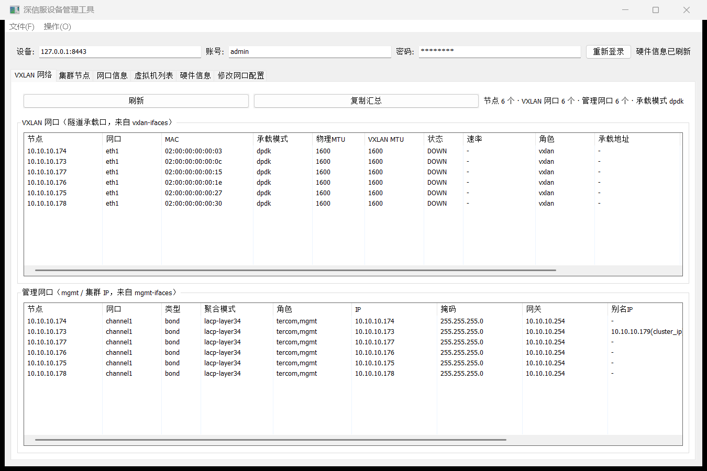
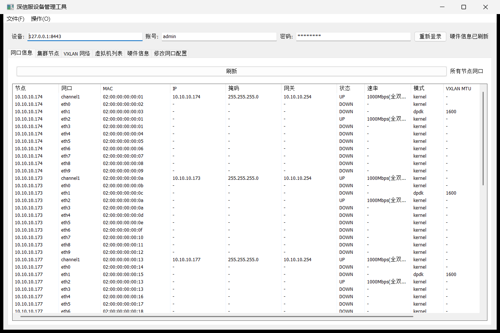

# 深信服超融合（HCI / aCloud）设备管理工具

面向深信服超融合 **vapi 接口**的 Windows 原生桌面客户端。通过逆向设备前端接口协议，
实现免浏览器登录、集群信息查询与网口配置修改。

**Go + lxn/walk 编写，纯 Go 无 CGO，编译产物是单个 exe，运行时无控制台黑框。**

> ⚠️ **免责声明**：本项目为个人运维工具，**与深信服科技无任何关联**，非官方产品。
> 接口协议由对**自有设备**的抓包与前端 JS 逆向得到，仅供在你自己拥有或已获授权的设备上使用。
> 请遵守设备厂商的许可协议与当地法律法规。

---

## 功能

| 页签 | 说明 |
|---|---|
| 集群节点 | 节点名 / hostid / 管理 IP / 状态 / 是否主节点 |
| 网口信息 | 全集群网口一览（节点、网口、MAC、IP、掩码、网关、状态、速率、模式、**VXLAN MTU**、角色、备注） |
| **VXLAN 网络** | 上：VXLAN 承载口（隧道口、VXLAN MTU、PCI、承载地址）；下：管理网口（bond 模式、集群 IP 别名、成员口）。两块可拖动分隔 |
| 虚拟机列表 | 分组、名称、vmid、状态、vCPU、内存 / 磁盘占用、操作系统、宿主节点 |
| 硬件信息 | 每节点一张卡片：序列号 / 机型 / CPU / 内存 / vCPU 超分 / 存储 / RAID / 网卡 / 风扇 / 电源，支持单节点一键复制 |
| 修改网口配置 | 选择节点 → 网口 → 修改 **IP / 掩码 / 网关 / MTU / 自定义名称 / 备注 / 链路模式**，先预览变更（等宽对齐差异表）再提交，带危险操作二次确认 |
| **配置VXLAN的IP** | VXLAN 承载 IP 池：多选节点 + IP 列表（支持按节点数自动生成连续 IP），提交后回显服务端算出的「节点 → IP」映射 |
| **端口聚合** | 创建聚合口（bond）：多选节点 + 成员口（取所选节点**物理口的交集**，每条标注「链路状态 + 是否空闲 / 被哪个聚合口占用」，空闲与 UP 排前，另有「只选空闲口」按钮）+ 聚合模式（可编辑下拉）。选中已被占用的口时提交确认框会单独告警 |
| **配置存储网** | 存储通信网口：**每节点一行**（存储 IP / 掩码 / 承载口 / VLAN），支持按起始 IP 自动递增填充；提交前先走设备侧网段冲突校验 |
| **配置业务口** | 业务口（SDN 拓扑「物理出口」）：多选节点 + 承载口 + 拓扑节点 ID（本地生成 UUIDv4，可重新生成） |

> **内置调试抓包（HAR）**：配置文件里一个开关即可让**所有网络请求**自动抓包。
> 开关项 `debug.capture_har`（默认 **false=关闭**），抓包文件默认落在
> `<程序同目录>/har/<日期>/sangfor-<设备地址>-<时间>-p<pid>.har`（标准 HAR 1.2，可直接用
> Chrome DevTools / Fiddler 打开）。**完整说明（开关、路径、命名规则、脱敏）见
> [docs/抓包调试说明.md](docs/抓包调试说明.md)**。

> 4 个网络配置页统一遵循 **「读现网 → 本地校验 → 设备侧预校验 → 预览差异 → 危险确认 → 提交 → 任务轮询 → 回读验证」**，
> 存储网 / 业务口采用**两阶段提交**（先只校验不写入，确认后再下发）。
> 接口细节见 [docs/网络配置接口说明.md](docs/网络配置接口说明.md)。

其它：

- 登录采用 RSA(PKCS#1 v1.5) 加密口令 + `CSRFPreventionToken` / `LoginAuthCookie` 双令牌鉴权
- 会话与上次输入自动缓存（可自动重填设备地址 / 账号 / 口令）
- 「网口信息」页一次请求拉取全集群网口（无需逐节点请求）
- 中文界面、现代控件外观（Common Controls 6 + PerMonitorV2 DPI）

## 界面截图





> 截图中的数据均为演示数据（`10.10.10.0/24` 网段与构造的 MAC）。

---

## 快速开始

### 方式一：直接运行

下载 Releases 中的 `sangfor-ifaces-gui.exe`，双击运行（Windows 10/11 x64，无需安装）。

登录栏填入设备管理地址（如 `192.168.1.100`，即超融合集群的登录地址）、账号、口令，点「登录」。
登录成功后会自动拉取节点 / 网口 / VXLAN / 虚拟机 / 硬件信息。

### 方式二：从源码构建

环境要求：**Go 1.21+**（开发环境为 Go 1.26.5）、Windows x64。
**不需要 gcc**（全项目 CGO_ENABLED=0，仅依赖纯 Go 的 `lxn/walk`）。

```bash
git clone https://github.com/yimu56/hci-tool.git
cd hci-tool
go mod download
go build -trimpath -ldflags "-H windowsgui -s -w" -o sangfor-ifaces-gui.exe .
```

或直接双击 / 执行 `build.bat`（国内网络会自动切 `goproxy.cn`）。

> 仓库内已包含 `app.manifest` 与生成好的 `rsrc.syso`（现代控件外观 + DPI 声明）。
> 如需改动清单，用 `rsrc -manifest app.manifest -o rsrc.syso -arch amd64` 重新生成。

---

## 项目结构

```
.
├── main.go                     # 全部逻辑：vapi 协议客户端 + Walk 界面
├── app.manifest / rsrc.syso    # 窗口清单资源（现代样式 + PerMonitorV2 DPI）
├── build.bat                   # 一键构建
├── go.mod / go.sum
├── docs/
│   ├── 接口说明.md              # vapi 接口还原结果、字段陷阱、离线验证方法
│   ├── 开发交接.md              # 项目状态、关键决策与踩坑记录
│   ├── 优化分析.md              # 代码审查与优化项清单
│   └── images/                 # 界面截图
└── backup/
    └── main_cli_backup.go      # 早期命令行版（保留备查）
```

运行期会在 **exe 同目录**生成两个文件，均已在 `.gitignore` 中排除：

- `.sangfor-config.json`：运行配置（调试抓包开关等，权限 0600）
- `har/`：调试抓包产物（若开启；**含会话凭据，默认已脱敏，仍请勿外发**）
- `.sangfor-session.json`：会话缓存（**含明文口令**，权限 0600）
- `.sangfor-lastinput.json`：网口修改的输入记忆

---

## 接口协议概要

登录共 6 步（详细字段见 [docs/接口说明.md](docs/接口说明.md)）：

```
1. GET  /login                              从 HTML 提取 RSAModulus（RSA-2048, e=0x10001）
2. POST /vapi/json/access/srand             username=<用户>
3. GET  /vapi/json/access/secret            → data.secret
4. POST /vapi/json/access/privacy/check     username=<用户>&join=1
5. POST /vapi/extjs/access/ticket           password=RSA_PKCS1_v1_5(明文口令 + secret)
                                            → data.CSRFPreventionToken
                                            → Set-Cookie: LoginAuthCookie=...
6. 后续所有 /vapi 请求必须【同时】携带：
     CSRFPreventionToken: <token>
     Cookie: LoginAuthCookie=<ticket>
```

查询接口：

| 功能 | 接口 |
|---|---|
| 集群节点 | `GET /vapi/json/cluster/nodelist` |
| 网口信息（单节点） | `GET /vapi/json/cluster/network/ifaces?node_id=<hostid>&refresh=1` |
| 网口信息（全集群） | `GET /vapi/json/cluster/network/ifaces`（不带 `node_id`，按节点分组一次返回） |
| 管理网口 | `GET /vapi/json/cluster/network/mgmt-ifaces` |
| VXLAN 网口 | `GET /vapi/json/cluster/network/vxlan-ifaces` |
| 虚拟机列表 | `GET /vapi/extjs/cluster/vms?group_type=group&scene=resources_used` |
| 硬件信息 | `GET /vapi/extjs/nodes/<hostid>/info` |

修改网口（写操作）：

```
1. PUT /vapi/json/nodes/<hostid>/network/ifaces/<iface>
        desc= & ip= & netmask= & gateway= & link_mode= & mtu= & mac= & custom_name=
        → data.task_id
2. GET /vapi/json/log/process?upid=<task_id>      轮询任务（process=0 表示进行中）
```

网络配置（写操作，详见 [docs/网络配置接口说明.md](docs/网络配置接口说明.md)）：

| 功能 | 读 | 校验 | 写 |
|---|---|---|---|
| VXLAN IP 池 | `GET /vapi/extjs/network/v1.0/vxlan-ip-pools?start=0&limit=20` | — | `POST /vapi/extjs/network/v1.0/vxlan-ip-pools`（JSON） |
| 端口聚合 | 取 `/cluster/network/ifaces` 中 `type=bond` | — | `POST /vapi/json/cluster/network/bonds`（form） |
| 存储网 | `GET /vapi/extjs/vs/vs_config/vs_networksetting_get?add_host=0` | `POST /vapi/json/vs/vs_config/vs_check_arbiter_same_netip` | `POST /vapi/extjs/vs/vs_config/vs_networksetting_set`（form，`data` 为 UPID） |
| 业务口 | `GET /vapi/json/cluster/network/business-ifaces[?refresh=1]` | `POST /vapi/json/asan/v1.0/networks/ifacecheck` | `POST /vapi/json/hci/sdn/ui/network-portal/nodes/action`（JSON） |

---

## 已知坑（都是实测踩出来的）

- **TLS**：设备只支持 TLS 1.2 + 静态 RSA 套件，不支持 TLS 1.3。客户端必须锁定
  `MinVersion/MaxVersion = TLS1.2`，否则握手直接失败。证书是自签名的。
- **HAR 里没有 Cookie**：Chrome 导出的 HAR 默认不含 `Cookie` 请求头。只看 HAR 会误以为
  「仅凭 token 鉴权」，结果所有业务请求 401。必须同时携带 `LoginAuthCookie`。
- **`link_mode` 不是 `speed.negotiation`**：`negotiation` 是"是否自动协商"的开关（1/0），
  不是链路模式编号。自动协商的编号各网卡不同，不要写死。
- **同一字段类型不一致**：`mgmt-ifaces` 的 `member_info[].speed` 是**数字**，
  而 `/ifaces` 里是**对象** —— 按单一结构体解析会导致整个响应解析失败。
- **Walk 框架**：`GridLayout` 需显式 `SetRange` 才排布；`ScrollView` 不能再包一层容器；
  刷新控件树前必须递归 `Dispose`（否则窗口叠加）。
- **布局拉伸**：`HBoxLayout` 会把多余横向空间摊给子控件（按钮/输入框被拉成一条），
  必须固定宽度 + 行尾加 `HSpacer`；`VBoxLayout` 同理会把多余纵向空间摊给标签行/分组框。
- **别给 `GroupBox` 设固定高度**：会与它自身的标题+边框布局冲突，内容被挤到顶部并与标题重叠。
- **`NewDropDownBox()` 返回的是 `*ComboBox`**（`CBS_DROPDOWNLIST` 样式），不是独立类型；
  取值用 `Text()`。
- **`VSplitter` 默认 50/50**：当"现网表格只有几行、编辑区需要多行"时会把编辑区压得看不见，
  改用「上侧固定高度 + 下侧自适应」。
- **窗口"最大化后标题栏（最小化/最大化/关闭）消失"**（实测必现，已修）：根因是 walk 的
  `FormBase.startLayout`（`form.go`）—— **每次布局只要客户区小于"布局最小尺寸"就 `SetSizePixels`
  把窗口撑大**。所以一旦"布局最小尺寸"超过屏幕可用客户区，窗口就会被撑得比屏幕还高，
  最大化时 Windows 把客户区扩成整个窗口，标题栏被内容盖住、三个按钮全都点不到。
  修法（三条一起做）：
  ① **让布局最小尺寸恒定且足够小** —— 页面里"随数据变化的控件"（复选框列表）必须**固定预留行数**
     （本工程 `reserveRows`），否则数据一多最小尺寸就变大、窗口又被撑高；
  ② **窗口初始尺寸按显示器工作区反算**（`applyWindowGeometry`：`min(布局最小尺寸, 工作区-16)`），
     并在 `Run()` 之后幂等收敛几次（walk 在 `Run()` 里还会撑一次）；
  ③ **"最大化"自己实现**（`toggleOwnMaximize`：拦截 `WM_SYSCOMMAND/SC_MAXIMIZE|SC_RESTORE`，
     把窗口铺满工作区而不用系统 zoom）—— 这样无论布局最小尺寸怎么变，标题栏都在、按钮永远可点。
  自查方法：`walk.CreateLayoutItemsForContainer(form).MinSizeForSize(size)` 的结果（像素）必须小于
  「最大化后可用客户区高度」（本环境 1436px）。**钳制 `PtMinTrackSize` 无效**（实测）。
- **`SetSize(1280, 780)` 在高 DPI 下会超出屏幕**：walk 的尺寸是 96DPI 逻辑单位，在 200% 缩放（DPI=192）
  的屏幕上 1280x780 会变成 2560x1560 **像素**，比 1280x800 逻辑分辨率的整块屏幕还大 —— 窗口一打开
  右半边就在屏幕外。正确做法：用 `MonitorFromWindow + GetMonitorInfo` 拿工作区（像素）→
  自己算目标矩形 → `SetWindowPos` 一次性设定；**摆位置要用 `SWP_NOSIZE`**
  （改尺寸的 `SetBoundsPixels`/`SetSize` 会被 walk 的 `startLayout` 再撑一次）。

更多细节见 [docs/接口说明.md](docs/接口说明.md)、[docs/网络配置接口说明.md](docs/网络配置接口说明.md)
与 [docs/开发交接.md](docs/开发交接.md)。

---

## 安全须知

- **修改网口是高危写操作**：改错 IP / 掩码可能导致管理连接中断甚至设备失联。
  界面提供"预览变更 → 二次确认"，请务必逐字段核对后再提交。
- **不要在不受信的机器上保存会话**：`.sangfor-session.json` 明文保存口令。
  如需更高安全性，可自行改为不保存口令或做加密存储。
- 请勿把抓包文件（`.har` / `.pcap`）与运行期生成的会话文件提交到公开仓库 ——
  前者含口令密文与真实地址，后者含明文口令与会话令牌（本项目 `.gitignore` 已覆盖）。
- 生产环境建议使用**最小权限账号**，并遵循厂商的变更流程。

---

## 开发说明

```bash
go vet ./...
gofmt -l .
```

项目自带一套**离线验证**做法（设备在 VPN 后面也能验证）：用抓包报文搭一个模拟 vapi 服务端，
再用纯 syscall 的无头驱动真实进程序点「登录」并截图断言界面。方法见
[docs/接口说明.md](docs/接口说明.md) 第七节。

---

## 许可证

[MIT](LICENSE) © 2026 yimu56
